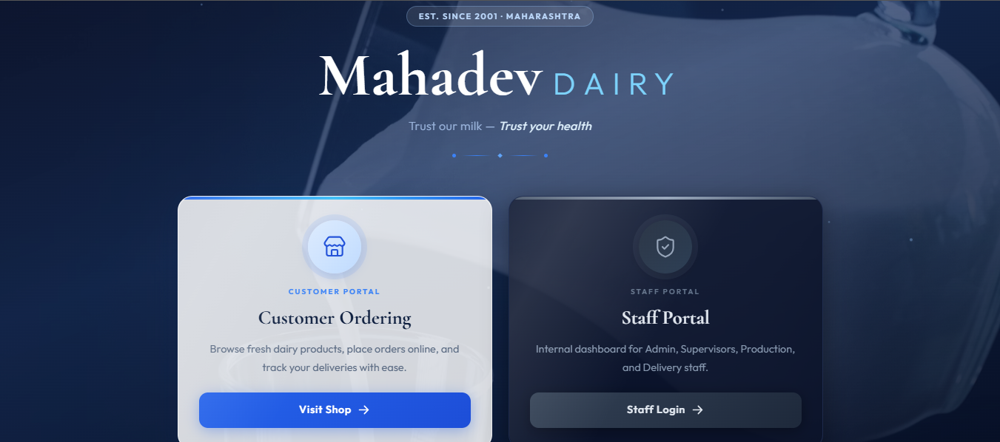
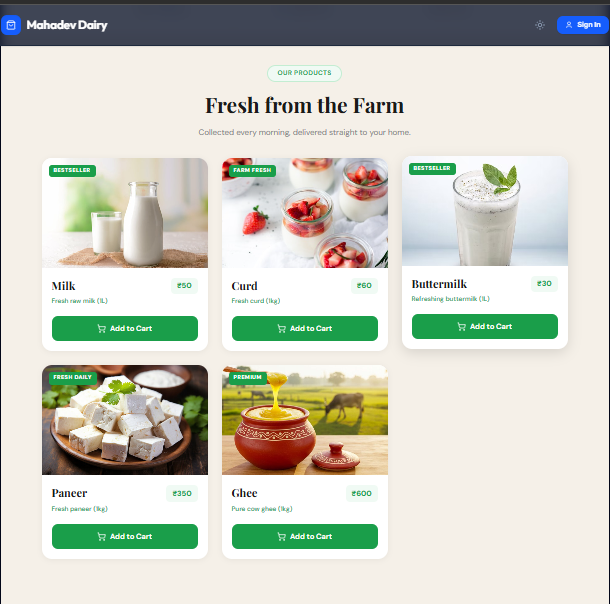
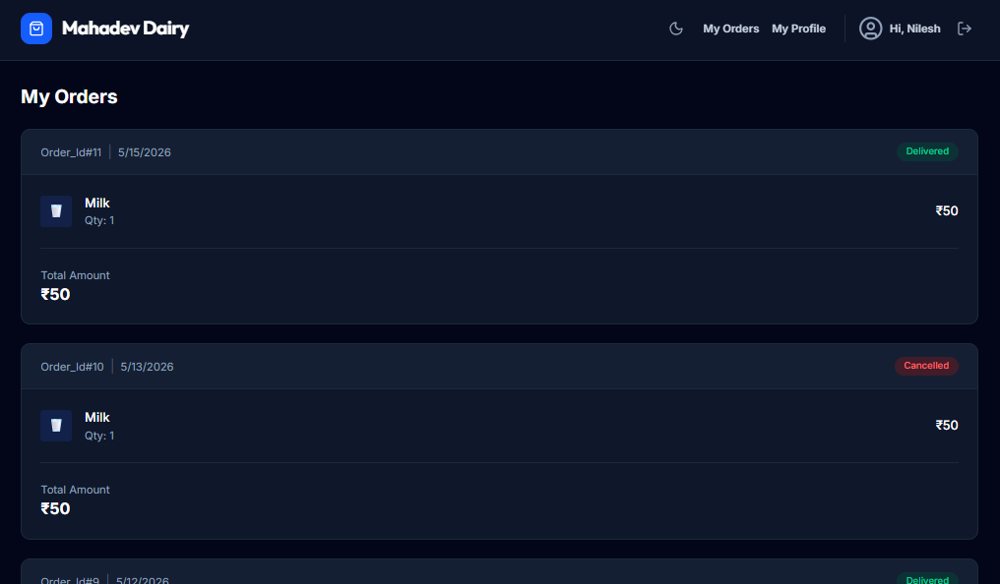
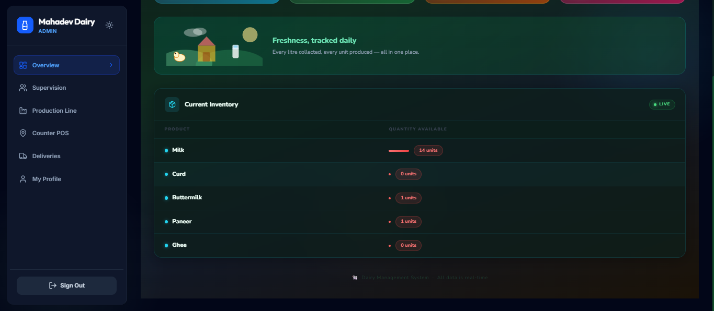
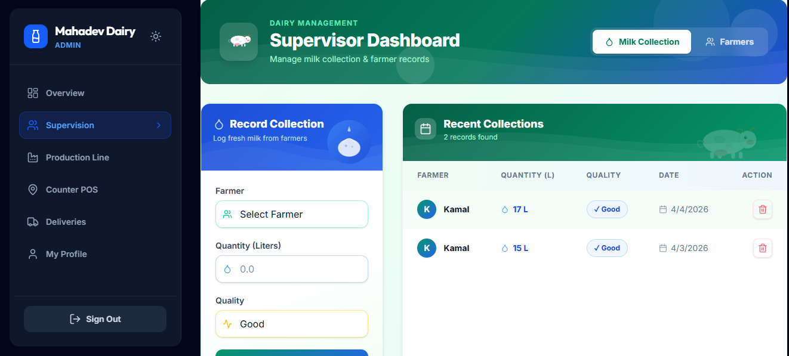
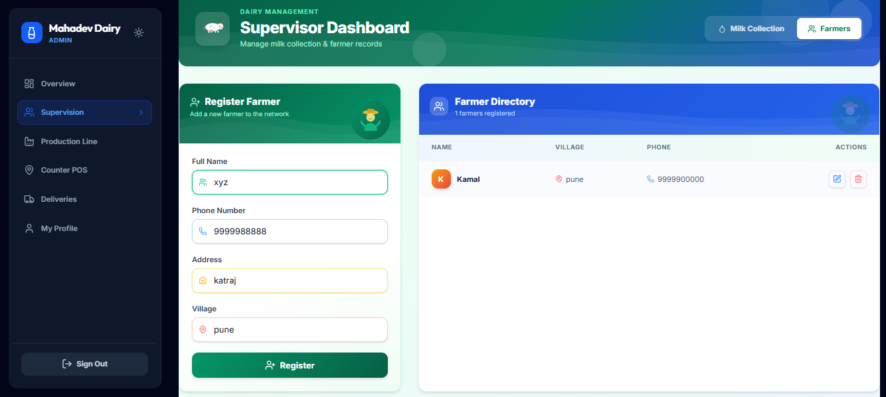
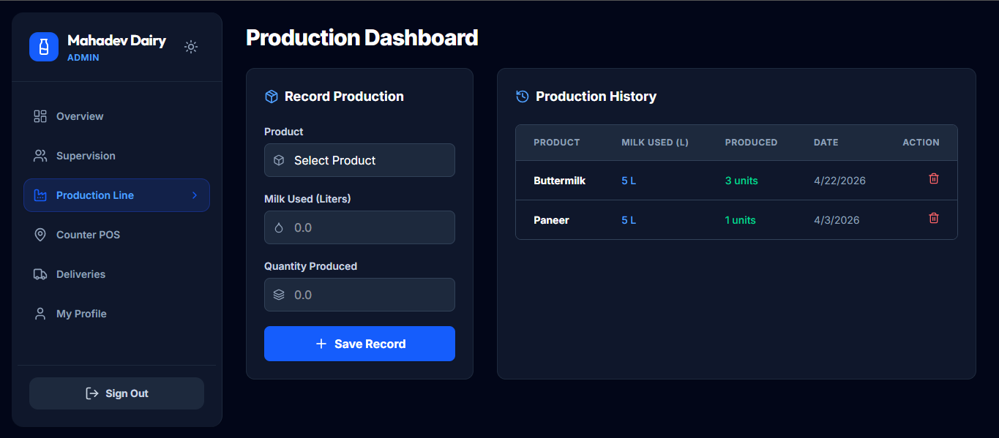
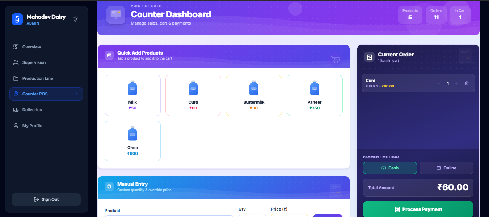
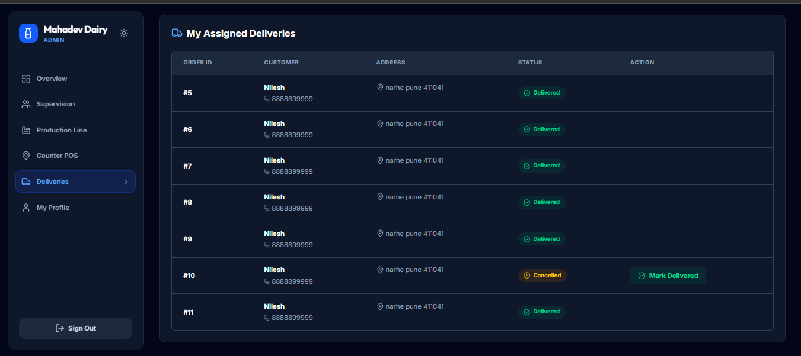

# 🥛 Dairy Management System

A modern and responsive **Dairy Management System** built for managing dairy operations efficiently. This project provides separate dashboards for Admin, Counter Staff, and Delivery Staff with authentication support and a clean UI.

---

## 🚀 Features

* 🔐 Secure Login Authentication
* 👨‍💼 Admin Dashboard
* 🧾 Counter Management Dashboard
* 🚚 Delivery Dashboard
* 📊 Dairy Operations Management
* 🌙 Dark / Light Theme Support
* ⚡ Fast and Responsive UI
* 📱 Mobile Friendly Design

---

## 🛠️ Tech Stack

### Frontend

* React + TypeScript
* Vite
* Tailwind CSS
* Redux
* React Router DOM
* Framer Motion

### Backend / Database

* Node.js
* Express.js
* Firebase

---

## 📂 Project Structure

```bash
src/
 ├── components/
 ├── pages/
 ├── lib/
 ├── server/
 ├── App.tsx
 └── main.tsx
```

---

## ⚙️ Installation

### 1️⃣ Clone the Repository

```bash
git clone https://github.com/your-username/dairy-management-system.git
```

### 2️⃣ Open Project Folder

```bash
cd dairy-management-system
```

### 3️⃣ Install Dependencies

```bash
npm install
```

### 4️⃣ Start Development Server

```bash
npm run dev
```

---

## 🔑 Admin Login Credentials

```txt
Email    : admin@dairy.com
Password : admin123
```

---

## 📸 Screenshots

### home Page


### Customer Order Page


### Cutomer Page Order Status


### Admin OverView Page


### Current Inventory Page


### Supervisor Page


### Farmer Entry Page


### Production Dashboard Page


### Counter Page


### Assigned Deliveries Page



---

## 🌟 Future Improvements

* Milk Inventory Tracking
* Online Order Management
* Customer Billing System
* Payment Integration
* Report & Analytics Export
* Role Based Access Control

---

## 🤝 Contributing

Contributions are welcome.

1. Fork the repository
2. Create a new branch
3. Commit your changes
4. Push to your branch
5. Open a Pull Request

---

## 📜 License

This project is licensed under the MIT License.

---

## 👨‍💻 Developer

Made with ❤️ by **Swapnil Dimble**

---

## ⭐ Support

If you like this project, give it a ⭐ on GitHub.

